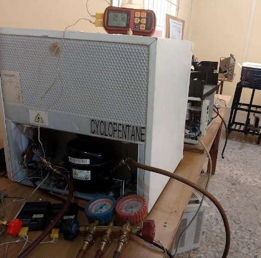

# nanolubricant-refrigeration-system

Development of and experimental investigation into the effects of nanolubricants on the performance of a vapour compression refrigration system.

## Overview

The study investigates the preparation and use of a nanolubricant in a vapour compression refrigeration system to evaluate the effect on thermal perfomance. It involved nanoparticle synthesis, nanolubricant development, experimental testing, chemical analysis and performance evaluation.

## Problem Statement

Improving energy efficiency for a refrigeration system would have significant effect on global energy consumption. The project explored whether using nanolubricnats woudl improve the performance of the refrigeration system in a stable system operation.

## Technical Summary

The technical summary of the project report is available in: [View technical Summary](docs/Technical-Summary.pdf)

## Project Information
**Author:** Edidiong Enobong Umoh
**Institution:** Afe Babalola University, Ado-Ekiti (ABUAD)
**Programme:** B.Eng. Mechanical Engineering
**Project Type:** Bachelor's Degree Project
**Year:** 2023

